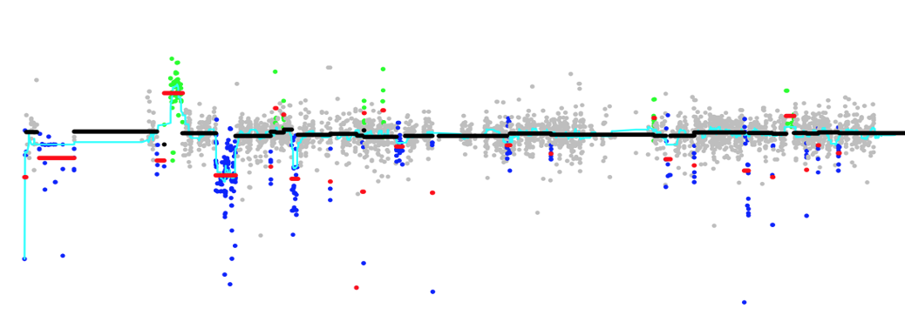

<!-- PROJECT LOGO -->
<br />
<p align="center">
  <a href="https://github.com/tf2/CNest">
    
  </a>

  <h3 align="center">CNest - The Copy Number Estimator</h3>

  <p align="center">
    Docker Implementation for CNest - Detection and Genome Wide Association Testing 
    <br />
    <a href="https://github.com/tf2/src/fluff/main_docs.md"><strong>Explore the docs »</strong></a>
    <br />
    <br />
    <a href="https://github.com/github_username/repo_name">View Demo</a>
  </p>
</p>


<!-- TABLE OF CONTENTS -->
## Table of Contents

* [About the Project](#about-the-project)
  * [Built With](#built-with)
* [Getting Started](#getting-started)
  * [Prerequisites](#prerequisites)
  * [Installation](#installation)
* [Usage](#usage)
* [License](#license)
* [Contact](#contact)
* [Acknowledgements](#acknowledgements)


<!-- ABOUT THE PROJECT -->
## About The Project

[![CNest GWAS][product-screenshot]](https://github.com/tf2/CNest/blob/master/src/fluff/cnv_gwas.png)

These methods allow large scale CNV detection from very large WGS and WES datasets and generate all the required information for proper genome wide association testing for copy number differences.


### Built With

* [Docker](https://docs.docker.com/)


<!-- GETTING STARTED -->
## Getting Started

To get a local copy up and running follow these simple steps.

### Prerequisites

Docker

### Installation

1. Clone the repo
```sh
git clone https://github.com/tf2/CNest.git
```
2. Build the docker image
```sh
docker build --tag cnv:1.0 .
```


<!-- USAGE EXAMPLES -->
## Usage

_For more examples, please refer to the [Documentation](https://github.com/tf2/CNest/blob/master/src/example_cnest_py.md)_


<!-- LICENSE -->
## License

Distributed under the MIT License. See `LICENSE` for more information.


<!-- CONTACT -->
## Contact

Tomas William Fitzgerald - [@tomaswfitz](https://twitter.com/tomaswfitz) - tomas@ebi.ac.uk

Project Link: [https://github.com/tf2/CNest](https://github.com/tf2/CNest)


<!-- ACKNOWLEDGEMENTS -->
## Acknowledgements
* Ewan Birney - [@ewanbirney](https://twitter.com/ewanbirney)
* Shimin Shuai


<!-- MARKDOWN LINKS & IMAGES -->
<!-- https://www.markdownguide.org/basic-syntax/#reference-style-links -->
[contributors-shield]: https://img.shields.io/github/contributors/github_username/repo.svg?style=flat-square
[contributors-url]: https://github.com/github_username/repo/graphs/contributors
[forks-shield]: https://img.shields.io/github/forks/github_username/repo.svg?style=flat-square
[forks-url]: https://github.com/github_username/repo/network/members
[stars-shield]: https://img.shields.io/github/stars/github_username/repo.svg?style=flat-square
[stars-url]: https://github.com/github_username/repo/stargazers
[issues-shield]: https://img.shields.io/github/issues/github_username/repo.svg?style=flat-square
[issues-url]: https://github.com/github_username/repo/issues
[license-shield]: https://img.shields.io/github/license/github_username/repo.svg?style=flat-square
[license-url]: https://github.com/github_username/repo/blob/master/LICENSE.txt
[linkedin-shield]: https://img.shields.io/badge/-LinkedIn-black.svg?style=flat-square&logo=linkedin&colorB=555
[linkedin-url]: https://linkedin.com/in/github_username
[product-screenshot]: images/screenshot.png
